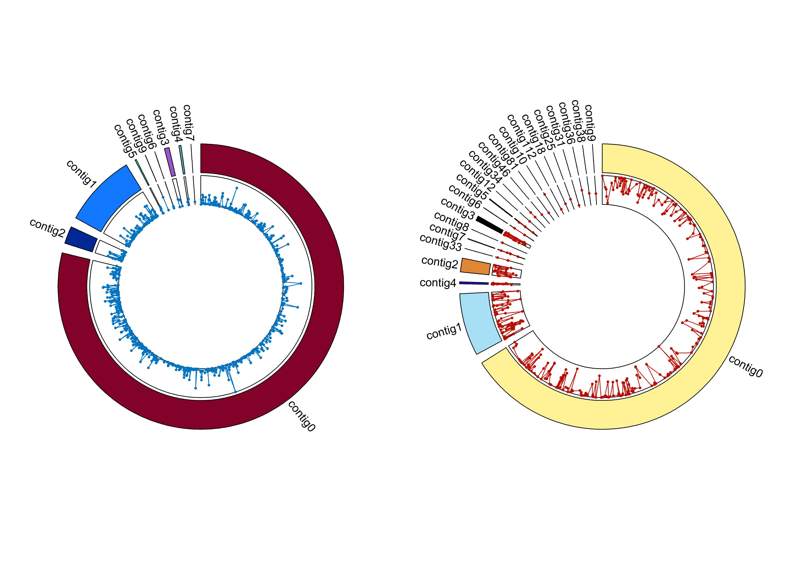

# Circos-from-Trinity (non-human genomes)

**Make Circos plots of RNA-seq DEGs (Up/Down) from *de novo* Trinity transcriptomes—no reference genome required.**
This toolkit has two parts:

1. **Bash**: converts a Trinity FASTA into BED-like coordinates suitable for Circos.
2. **R package**: maps DEGs onto those pseudo-chromosomes and renders Circos plots (Upregulated vs Downregulated).

> **Works for Trinity *de novo* assemblies and non-human organisms.**
> DEG points are colored by regulation (Up/Down) on pseudo-chromosomes derived from Trinity component IDs.

---

## Contents

* `inst/scripts/trinity2circos.sh` – Bash preprocessor (FASTA → `preBED.tsv`)
* R function: `circosplot_degs()` (in the package) – plotting + export
* Example workflows and output files

---

## Requirements

* **Trinity FASTA** with headers like: `>TRINITY_DNxxxxx_c<comp>_g<gene>_i<isoform> …`
* **DEGs CSV** with at least:

  * `Gene_id` (matches Trinity gene IDs after trimming isoform suffixes)
  * `log2FC`
  * `DEGs` (exactly `Upregulated` or `Downregulated`)
* **R ≥ 4.1** and packages: `circlize`, `tidyverse` (auto-installed by the function).
  Optional for combining images: `magick`, `cowplot`, `ggpubr`.
* Shell with standard Unix tools: `awk`, `grep`, `sed`, `sort`.

---

## Installation

```r
# Install R package (from local path or GitHub once published)
# remotes::install_github("youruser/Circos-from-Trinity")
library(CircosFromTrinity) # replace with your package name
```

Make the Bash script executable:

```bash
chmod +x inst/scripts/trinity2circos.sh
```

---

## Quick Start

### 1) Build pseudo-chromosomes from Trinity FASTA

```bash
# Produces preBED.tsv (BED-like: Chr, Gene_id, Start, End)
./inst/scripts/trinity2circos.sh -i Trinity.fasta
```

This script:

* Collapses Trinity isoforms to **gene-level** entries.
* Assigns cumulative start/end coordinates per Trinity **component** (as “chromosomes”).
* Writes `preBED.tsv` in the current directory.

### 2) Plot DEGs with R

```r
circosplot_degs(
  ruta_degs = "path/to/degs/",
  archivo_degs = "TREATMENT_degs.csv",
  ruta_transcriptoma_modificado = "path/to/",
  archivo_transcriptoma_modificado = "preBED.tsv",
  deg_col_up   = "#0073C2FF",
  deg_col_down = "#bb0c00",
  formatos     = c("tiff", "jpeg", "png", "svg", "pdf"),
  resolucion   = 600
)
```

**Outputs (in a new folder `path/to/TREATMENT_circosplot/`):**

* `circos_up.tiff|jpeg|…`, `circos_down.tiff|jpeg|…` – Circos images for Up/Down


*Figure 1. Circosplot with DEGS.*

* `circos_up.csv`, `circos_down.csv` – minimal plotting tables (Chr, Inicio, Fin, log2FC)
* `circos_up_source.csv`, `circos_down_source.csv` – joined source tables for audit

---

## Input formats

### `preBED.tsv` (produced by the Bash script)

```
Chr   Gene_id                 Start    End
chr4  TRINITY_DN123_c4_g2     0        842
chr4  TRINITY_DN987_c4_g7     842      1660
...
```

### `*_degs.csv` (your DEGs)

```csv
Gene_id,log2FC,DEGs
TRINITY_DN123_c4_g2,  2.15, Upregulated
TRINITY_DN987_c4_g7, -1.80, Downregulated
...
```

> **Note**: `Gene_id` must match the Trinity gene ID used in `preBED.tsv` (isoform suffixes like `_i1` are already removed by the Bash script).

---

## Why this works for non-human genomes

* **No reference genome needed**: pseudo-chromosomes are derived from Trinity **components**.
* **Species-agnostic**: any organism assembled with Trinity can be visualized.
* **DEG aware**: Upregulated and Downregulated sets are plotted separately (custom colors).

---

## Function reference (R)

```r
circosplot_degs(
  ruta_degs,
  archivo_degs,
  ruta_transcriptoma_modificado,
  archivo_transcriptoma_modificado,
  deg_col_up = "blue",
  deg_col_down = "red",
  formatos = "jpeg",
  resolucion = 300
)
```

* **ruta\_degs / archivo\_degs**: folder + filename of DEG CSV.
* **ruta\_transcriptoma\_modificado / archivo\_transcriptoma\_modificado**: folder + `preBED.tsv`.
* **deg\_col\_up / deg\_col\_down**: colors for Up/Down points/lines.
* **formatos**: one or multiple output formats.
* **resolucion**: DPI for raster outputs.

---

## Tips & caveats

* **Header format matters**: the Bash script expects Trinity names with `_c<comp>_g<gene>_i<isoform>`.
* **Too many components?** Circos can look crowded. Consider filtering to DEGs of interest or top |log2FC|.
* **Consistency**: ensure DEG `Gene_id` strings match the gene IDs in `preBED.tsv` (gene level, no isoform suffix).
* **Reproducibility**: keep `circos_*_source.csv` alongside figures.

---

## Example workflow

```bash
# 1) Prepare coordinates
./inst/scripts/trinity2circos.sh -i data/Trinity.fasta

# 2) Plot in R
R -q -e 'library(CircosFromTrinity);
  circosplot_degs(
    ruta_degs="data/degs/",
    archivo_degs="NACL_degs.csv",
    ruta_transcriptoma_modificado="data/",
    archivo_transcriptoma_modificado="preBED.tsv",
    formatos=c("tiff","svg"),
    resolucion=600
  )'
```
---

## Troubleshooting

* **Empty plots**: check that `Gene_id` in DEGs matches `preBED.tsv`.
* **R can’t find `circlize`**: it’s auto-installed; if blocked, install manually: `install.packages("circlize")`.
* **Weird chromosomes**: verify Trinity header pattern; non-standard names may require adapting the Bash parsing.

---

## License & citation

* License: MIT (or your choice).
* If you use this tool, please cite this repository and the **circlize** R package.

---

## Acknowledgements

Built by Valentin Galvan. Thanks to the **circlize** authors for an awesome plotting library.

## 👩‍💻 Author
Developed with ❤️ in R and Bash by [LinkedIn](https://www.linkedin.com/in/santiagovalentingalvangordillo) | [ORCID](https://orcid.org/0000-0001-6609-5661)   
